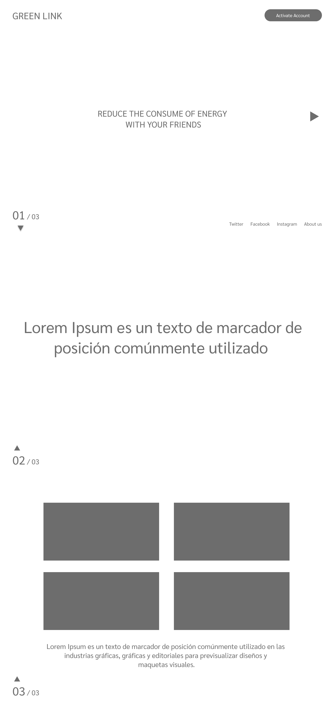
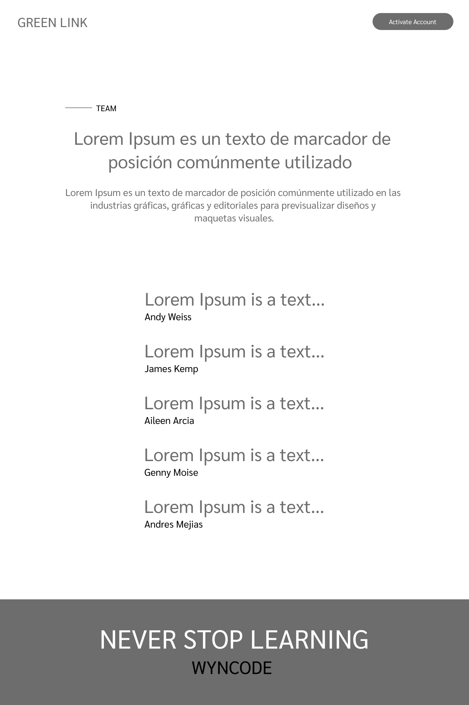
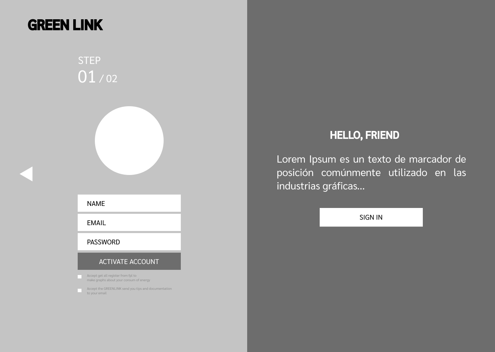
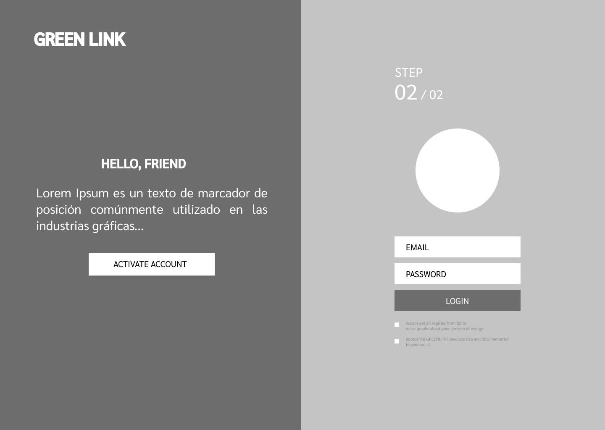
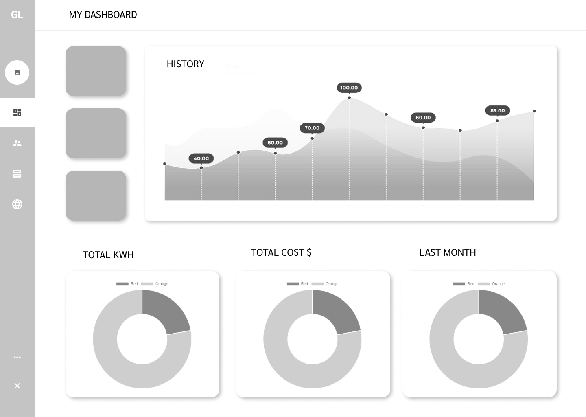
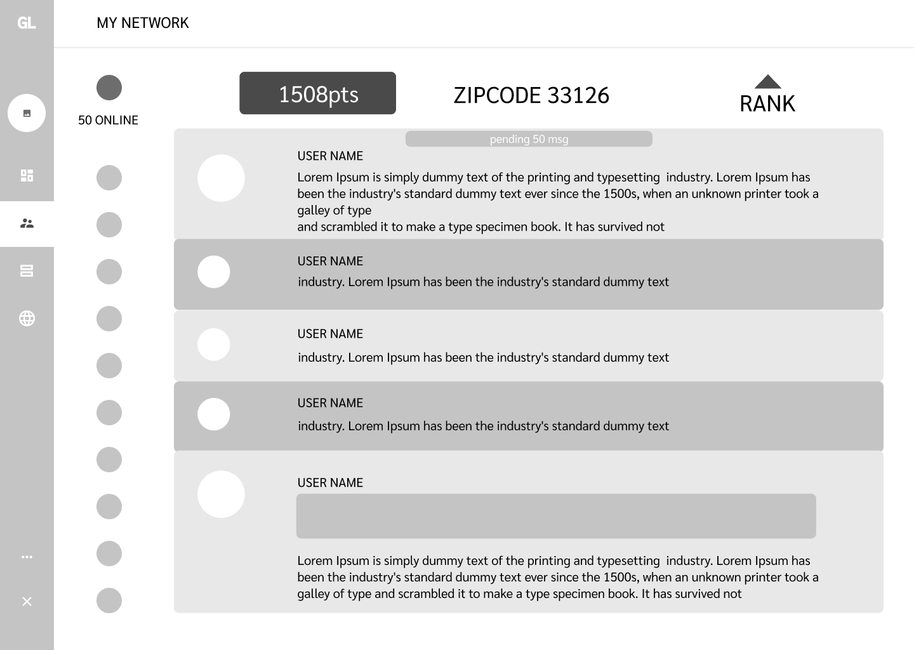
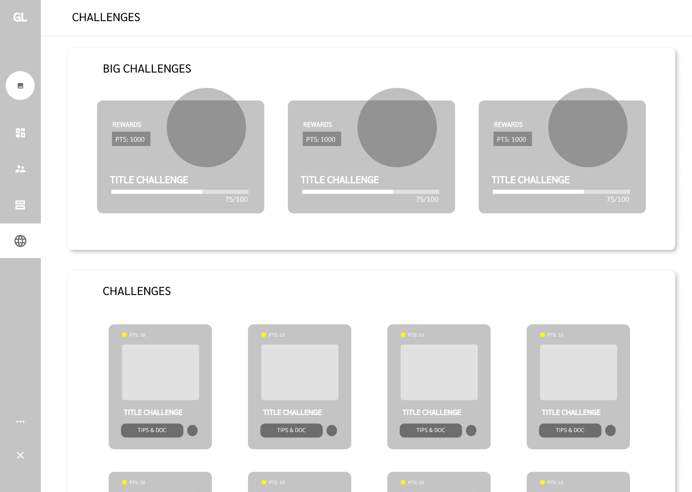
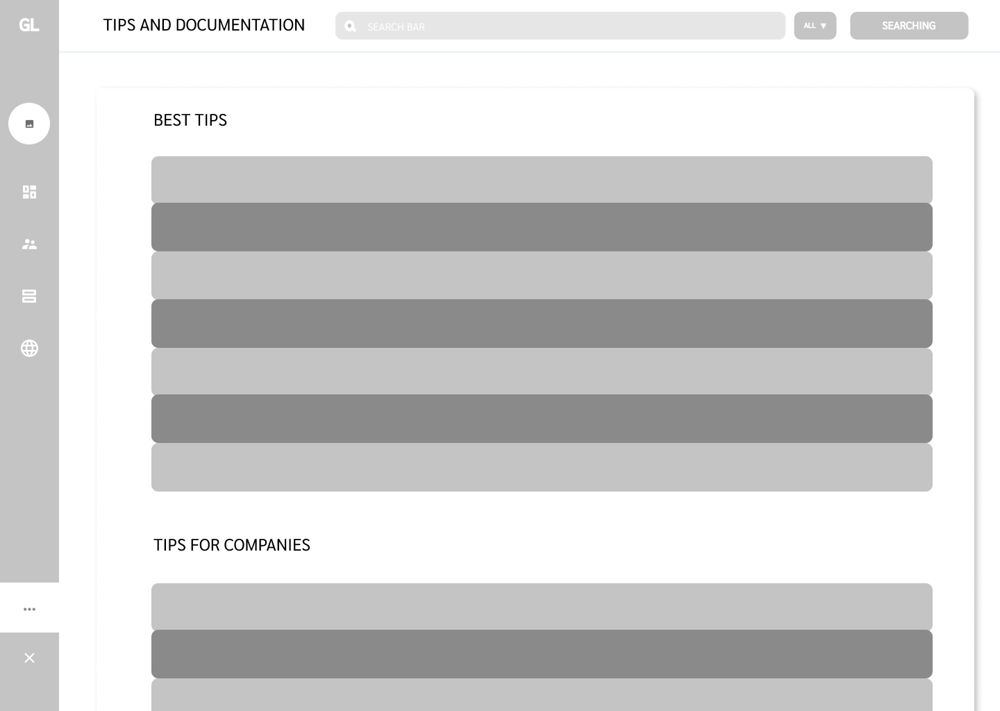
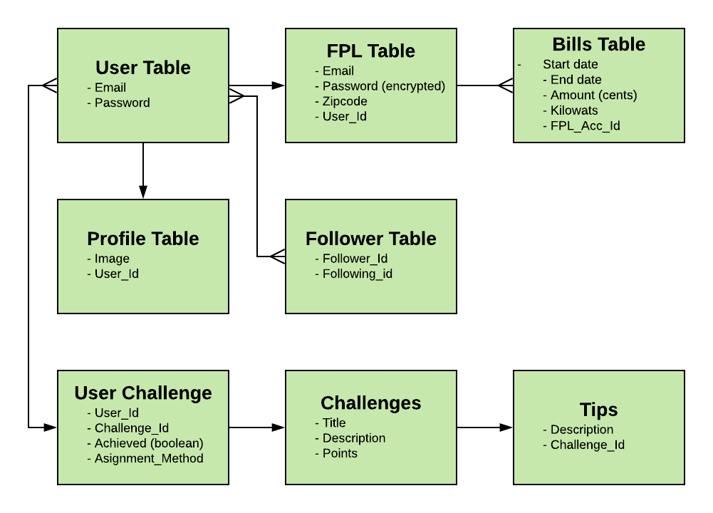

# Final Project: 

## Wireframes

## ERD

Swap it out with your actual ERD...

# README

This is a boilerplate Rails project that uses:

* `ruby ~> 2.6`
* `postgresql` as the database
* `webpacker` with `react`
* the `react_on_rails` gem

## Instructor Setup

* `git clone git@github.com:wyncode/final_project_template.git`
* `cd final_project_template`
* `git remote remove origin`
* Create a repo on GitHub that matches the project name
* `git remote add origin that-repo-name` && `git push origin -u master`
* Make `master` a [protected branch](https://help.github.com/articles/configuring-protected-branches/)
* Pull Requests should only be mergeable after 2 reviews
* At least 1 review needs to be from a [CODEOWNER](https://help.github.com/articles/about-codeowners/)
* Invite team members as collaborators with write access
* Create a Slack Channel, invite team members and TAs
* in Slack: `/github subscribe wyncode/repo_name issues,reviews,comments`

## Student Setup

* `rails db:create` (with your Postgres server up and running)
* `bundle`
* `yarn`
* `rails s`

## Collaboration

* Talk to an instructor about the next feature / enhancement / bugfix you would like to address
* Create an issue with a User Story and Acceptance Criteria
* Create a branch that corresponds with your issue
* Submit a pull request into master
* Request a code review from one of your teammates
* Once it's approved, request a code review from one or more of the project's [CODEOWNERS](CODEOWNERS)

## Deployment

### The Node.js buildback must be added first or precompiling of assets may fail on Heroku: [See this issue](https://github.com/rails/webpacker/issues/1164#issuecomment-443474860)

* `heroku create your-app-name`
* `heroku buildpacks:set --index 1 heroku/nodejs`
* `heroku buildpacks:add heroku/ruby`
* `git push heroku master`
* `heroku run rails db:migrate`
* _optional_: `heroku run rails db:seed`
